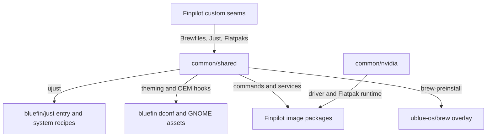

# Common Overlay Assessment

**Decision-ticket evidence for:** [Map shared-overlay capabilities and dependencies](https://github.com/Siddhj2206/finpilot/issues/3)
**Upstream snapshot:** [`projectbluefin/common@45080bc`](https://github.com/projectbluefin/common/tree/45080bc5a4fee999abc71a6410048350a41ef726)

## Result

`common` is a filesystem-overlay provider, not a single indivisible feature.
Its [`shared/`, `bluefin/`, and `nvidia/` layer rules](https://github.com/projectbluefin/common/blob/45080bc5a4fee999abc71a6410048350a41ef726/system_files/README.md)
remain the useful ownership model. Finpilot should rely on `shared/` for its
full-featured default and make NVIDIA a paired hardware feature, but it cannot
blindly copy only `shared/`: several shared user experiences have concrete
providers in `bluefin/` or need packages installed by the image.

The implementation should make overlay selection explicit in the Containerfile
or a build script it calls. Do not introduce a separate metadata/configuration
format merely to represent these selections.

## Capability map

| Shared capability | Main payload | Dependency/constraint | Finpilot direction |
| --- | --- | --- | --- |
| Declarative custom Flatpaks | `flatpak-preinstall.service` | Requires `flatpak`; service must be enabled/preset | **Default**; it makes the existing `custom/flatpaks` seam real |
| User custom commands | `ujust`, shared Just recipes | `ujust` invokes `/usr/share/ublue-os/just/00-entry.just`, supplied by `bluefin/` | **Default with required compatibility slice** |
| Homebrew first-user setup | `brew-preinstall`, user service, Brewfiles | Requires the Brew OCI overlay, Homebrew, `jq`, and user-service preset | **Default**; aligns with existing Brewfile seam |
| First-boot hook framework | `ublue-{system,user,privileged}-setup`, services, `libsetup.sh` | Requires `jq`; individual hooks can add package/desktop dependencies | **Default infrastructure**; only enable/copy hooks whose dependencies are selected |
| Container trust policy | containers policy, registry configuration, public keys | Policy is an explicit security/product decision | **Default candidate**; audit allowed registries before enabling |
| Bootc update staging | `bootc-update-stage`, ChairLift desktop/polkit/config | Requires ChairLift and `uupd`; user-facing configuration is Bluefin-branded | **Paired optional feature**, not shared-only default |
| Background update policy | `uupd` units/presets/AC configuration | Requires `uupd`; carries Bluefin-specific service configuration | **Paired optional feature**, decided with release/update policy |
| Shell, welcome, and system bling | profile scripts, `uwelcome` config, `ublue-fastfetch`, `ublue-bling` | Requires `uwelcome`, `umotd`, `fastfetch`, `gum`, and `jq`; current config calls `ujust bluefin-cli` | **Default only with Finpilot-owned branding/config replacement** |
| OEM and hardware helpers | udev rules, Framework/ASUS hooks/assets, ChairLift | Several hooks assume GNOME dconf, `asusctl`, or Bluefin command-menu configuration | **Opt-in or dependency-guarded default**, not a blind overlay |
| Bluefin application bundles | shared Homebrew Brewfiles | `artwork.Brewfile` explicitly pulls Bluefin wallpapers | **Optional**, not Finpilot default package policy |

## Cross-layer dependency graph

The exact current cross-layer references are:

1. `shared/usr/bin/ujust` invokes
   `/usr/share/ublue-os/just/00-entry.just`, which exists in `bluefin/`, not
   `shared/`.
2. `shared/etc/uwelcome/config.json` invokes `ujust bluefin-cli`; its current
   provider is Bluefin's `system.just` and bling environment.
3. `shared` theming/OEM setup hooks write GNOME dconf paths, including the
   Bluefin custom-command-menu configuration and icon.
4. shared ChairLift files call or configure ChairLift and `uupd`; neither
   executable is supplied by the overlay itself.
5. `nvidia` is independent of `bluefin/`, but its runtime-sync service only
   makes sense alongside a real NVIDIA driver installation, Flatpak, and a
   Flathub remote.

## NVIDIA decision

The NVIDIA overlay consists of one conditional systemd service and its helper.
When an NVIDIA module is absent, the service does not run. When present, it
keeps system Flatpak GL/GL32 NVIDIA runtimes aligned with the installed driver.

Treat it as an **atomic pair**:

1. the NVIDIA driver/akmods installation path; and
2. `common/nvidia` plus an enabled
   `ublue-nvidia-flatpak-runtime-sync.service`.

Copying the overlay without a supported driver install is harmless only because
of its condition; it is not a usable NVIDIA feature. The rewrite should retain
the existing NVIDIA capability but recast it as a documented, validated opt-in
instead of a disconnected example script.

## Required composition choices

The current Finpilot Containerfile imports all common files into build context
but overlays none of them into the final image. The rewrite must choose and
test a composition policy:

1. overlay `common/shared` as the default full-featured substrate;
2. copy the smallest `bluefin/` compatibility slice needed by selected shared
   capabilities, beginning with `just/00-entry.just`;
3. replace Bluefin-branded configuration (especially `uwelcome` and its
   `bluefin-cli` command) with Finpilot-owned equivalent configuration before
   making it default;
4. copy desktop/OEM hooks only with their GNOME settings, assets, and package
   requirements, or omit/disable those individual hooks; and
5. activate `common/nvidia` only alongside its driver feature.

This is an explicit composition list, maintained where image assembly already
lives. It is more auditable than an all-or-nothing `COPY /system_files /` and
does not create a second configuration language.

## Validation implications

The implementation ticket must prove:

- Flatpak preinstall declarations are actually consumed at boot;
- `ujust` has a valid entry file and can discover Finpilot custom recipes;
- Brew first-user setup sees Finpilot Brewfiles;
- no default command, welcome screen, or desktop entry exposes unwanted
  Bluefin identity;
- every selected systemd unit has its executable/package provider; and
- NVIDIA driver updates cause the conditional Flatpak runtime-sync behavior.
