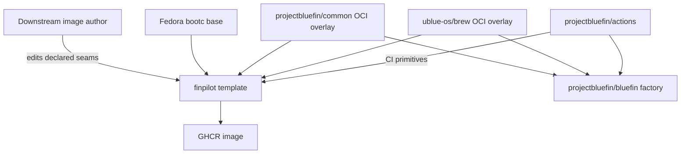

# Finpilot Template Architecture Map

**Snapshot date:** 2026-09-06
**Purpose:** Establish the current template's boundaries, extension seams, and
upstream contracts before modernization. This is a map, not a migration plan.
It deliberately separates the flexible downstream product from the much more
opinionated Bluefin factory.

## Scope and evidence

This map covers:

- this `siddhj2206/finpilot` checkout at `b49be7a`;
- `projectbluefin/common` at
  [`45080bc`](https://github.com/projectbluefin/common/tree/45080bc5a4fee999abc71a6410048350a41ef726);
- `projectbluefin/actions` at
  [`9c69981`](https://github.com/projectbluefin/actions/tree/9c699818ddf1043b8f5af8b862f59f783c6c7bda);
- `projectbluefin/bluefin` at
  [`c442e5c`](https://github.com/projectbluefin/bluefin/tree/c442e5c46f6d3a0e95dda5b1d6794dc7f56906ae); and
- `projectbluefin/brew` at
  [`6f0e89a`](https://github.com/projectbluefin/brew/tree/6f0e89a07f902fcff674bde2e46ee7820729ee55).

All upstream links are commit-pinned intentionally. `main` is a moving target;
use a new snapshot when making an implementation decision.

> [!IMPORTANT]
> `projectbluefin/brew` has moved: its current README points consumers to
> [`ublue-os/brew`](https://github.com/ublue-os/brew). Finpilot already consumes
> `ghcr.io/ublue-os/brew`, so the active product contract is the latter image,
> not the archived Project Bluefin repository.

## System context

There are four different responsibilities here:

| Component | Owns | Does not own |
| --- | --- | --- |
| **finpilot** | A small, forkable image definition; user choices; local build and image publishing caller | Bluefin's complete desktop product or factory release process |
| **common** | Reusable filesystem content and runtime integration shared by Bluefin-family images | A final OS image or a downstream user's product branding |
| **brew** | The Homebrew archive and runtime setup files | The downstream packages selected by a Brewfile |
| **actions** | Versioned CI building blocks and reusable factory workflows | An image's package choices, branches, or release policy |
| **bluefin** | A production GNOME workstation and its high-assurance factory/release system | The minimum contract every template fork must implement |

## Finpilot today

### Image assembly

[`Containerfile`](../Containerfile) is the assembly root:

1. it imports `common` and `ublue-os/brew` as digest-pinned OCI build stages;
2. a scratch `ctx` stage holds local `build/` and `custom/` plus both imported
   `/system_files` trees;
3. it starts from a digest-pinned Fedora Silverblue bootc base;
4. it runs [`00-image-info.sh`](../build/00-image-info.sh), then
   [`10-build.sh`](../build/10-build.sh), then
   [`clean-stage.sh`](../build/clean-stage.sh); and
5. it makes `/opt` mutable through `/var/opt`, defines `systemd` as the command,
   and runs `bootc container lint --fatal-warnings`.

The numeric filenames communicate intended ordering, but **the Containerfile is
the actual execution list**. Adding `20-foo.sh` has no effect until its explicit
`RUN` is added. [`build/README.md`](../build/README.md) documents this correctly.

`00-image-info.sh` writes the uBlue `image-info.json` contract and augments
`os-release`. Its inputs are Containerfile build arguments, making image
identity currently split between Containerfile defaults, `Justfile` local
overrides, and workflow-derived GitHub repository identity.

`10-build.sh` is the primary downstream customization seam:

- installs image-resident RPMs through `dnf5`;
- can use the local COPR helper;
- copies every `custom/brew/*.Brewfile` to
  `/usr/share/ublue-os/homebrew/`;
- concatenates `custom/ujust/*.just` into
  `/usr/share/ublue-os/just/60-custom.just`;
- copies `custom/flatpaks/*.preinstall` into Flatpak's preinstall directory;
- enables the Brew services supplied by the Brew overlay.

It currently imports `common` into `/ctx/oci/common` but does not overlay it
into the final filesystem. Therefore common is presently an available build
input, not a runtime content dependency. This distinction is important: copying
`common` wholesale would silently make the template Bluefin-opinionated.

### Supported author-facing seams

| Need | Current seam | Lifecycle |
| --- | --- | --- |
| Base distribution/desktop | Base `FROM` and related identity arguments | Build time |
| Immutable system packages and services | `build/10-build.sh` | Build time |
| Optional complex examples | `build/*.sh.example`, manually activated in Containerfile | Build time |
| User-installed Homebrew applications | `custom/brew/*.Brewfile` | First-user/runtime |
| User-facing administrative commands | `custom/ujust/*.just` | Runtime |
| First-boot Flatpaks | `custom/flatpaks/*.preinstall` | Post-install/first boot |
| VM/ISO artifacts | `Justfile` plus `iso/*.toml` | Local operator workflow |
| Published image identity | Repository name in CI; local defaults in Containerfile/Justfile | Build/publish |

This is the correct general shape for a template: image contents, declarative
user packages, and user commands are separate. The main future concern is
reducing duplicated identity/configuration values without hiding the choices an
adopter must make.

### Local operator interface and verification

[`Justfile`](../Justfile) provides:

- formatting/syntax, Bats unit tests, Brewfile validation, linting, and cleanup;
- `just build`, using Podman and labels/version information;
- bootc-image-builder conversions to QCOW2, RAW, and ISO; and
- QEMU or `systemd-vmspawn` launch paths.

The repository also carries Bats tests for image-info, build, cleanup, COPR,
custom Just, Brewfile validation, and the local recipes. This is a useful
template-level safety net; it should remain focused on the template's contracts
rather than attempt Bluefin's end-to-end desktop validation.

### Delivery and automation

The build workflow currently uses individual
[`projectbluefin/actions`](https://github.com/projectbluefin/actions/tree/9c699818ddf1043b8f5af8b862f59f783c6c7bda/bootc-build)
composites: preflight, runner setup, DNF cache, change detection, tag generation,
optional `chunka`, GHCR push, and keyless signing/provenance. It derives the
published image name and owner from GitHub, so the repository is the publish
identity in CI.

Additional workflows validate PRs, unit tests, Justfiles, Flatpak declarations,
Brewfiles, and Renovate; manage Renovate; clean old images; and implement a
`main`/`stable` promotion and reverse-sync model. Renovate owns digest updates
for the base and OCI contexts.

## Upstream maps

### `projectbluefin/common`: shared runtime overlay

[`common`](https://github.com/projectbluefin/common/tree/45080bc5a4fee999abc71a6410048350a41ef726)
builds an OCI artifact whose public payload is `/system_files`.
Its [layer rules](https://github.com/projectbluefin/common/blob/45080bc5a4fee999abc71a6410048350a41ef726/system_files/README.md)
divide content into:

| Directory | Meaning |
| --- | --- |
| `system_files/shared/` | Cross-product runtime infrastructure: setup hooks, ujust, security/container policy, shell/MOTD, system services, and hardware support |
| `system_files/bluefin/` | Bluefin GNOME identity and desktop opinion: dconf, branding/wallpapers, extensions, Bazaar, Bluefin recipes |
| `system_files/nvidia/` | NVIDIA-only runtime content |

The source also builds a few generated assets (ujust shell completion, U2F and
game-controller udev rules, `umotd`, and `uwelcome`) before emitting those
directories. Its shared layer is consciously reusable; its Bluefin layer is
not generic template material.

**Template implication:** consume a narrow, documented subset of `shared/` only
when the template intentionally adopts that runtime feature. Avoid copying all
of `/system_files`, and never take `bluefin/` merely to obtain one utility.
The flexible alternative is to let an adopter opt into clearly named overlays.

### Brew: Homebrew runtime substrate

The old
[`projectbluefin/brew`](https://github.com/projectbluefin/brew/tree/6f0e89a07f902fcff674bde2e46ee7820729ee55)
is a minimal archive builder: it installs Linuxbrew into `/home/linuxbrew`,
compresses it as `homebrew.tar.zst`, and exports it with `system_files`.
The repository explicitly says it moved to `ublue-os/brew`.

Finpilot's active usage is sound at the architectural level: it copies the
published Brew `system_files` into its context and overlays them before placing
the user's Brewfiles. Brew therefore supplies the **mechanism**; finpilot
supplies the **package declarations**. Do not fork or reproduce Brew setup
unless the upstream image cannot meet a concrete template requirement.

### `projectbluefin/actions`: CI platform

[`actions`](https://github.com/projectbluefin/actions/tree/9c699818ddf1043b8f5af8b862f59f783c6c7bda)
is the shared CI API. Its
[consumer contract](https://github.com/projectbluefin/actions/blob/9c699818ddf1043b8f5af8b862f59f783c6c7bda/docs/consumer-contract.yml)
defines compatibility for external consumers. The composable surface is:

| Concern | Primary action |
| --- | --- |
| Runner and build cache | `setup-runner`, `preflight`, `dnf-cache` |
| Validation and scope detection | `validate-pr`, `detect-changes` |
| OCI tags, push, manifest, cleanup | `generate-tags`, `push-image`, `create-manifest`, `ghcr-cleanup` |
| Supply chain | `sign-and-publish`, `scan-image` |
| Update efficiency | `rechunk` or OCI-native `chunka` |
| Factory orchestration | reusable build, promotion, sync, release, Renovate, and vulnerability workflows |

For a template, individual pinned composites are preferable when they make the
adopter's build transparent. Reusable factory workflows are preferable only
where their policy is genuinely shared. A template should not inherit Bluefin's
release gates, E2E lab flow, or multi-variant matrix simply because the action
exists.

**Observed drift:** finpilot's `label-enforcement.yml` references
`reusable-design-enforcement.yml` at an old actions commit, but that workflow is
not present in the current actions snapshot. This needs a deliberate migration
to the current shared label-workflow owner, not a blind reference bump.

### `projectbluefin/bluefin`: reference product and factory

[`bluefin`](https://github.com/projectbluefin/bluefin/tree/c442e5c46f6d3a0e95dda5b1d6794dc7f56906ae)
is the closest architecture reference, not a template dependency.

Its [architecture document](https://github.com/projectbluefin/bluefin/blob/c442e5c46f6d3a0e95dda5b1d6794dc7f56906ae/docs/architecture.md)
defines:

- a Containerfile, Justfile, ordered base scripts, shared helpers, overlays,
  Bats tests, and CI callers;
- a deliberate cache boundary: package/kernel installation occurs before final
  filesystem overlay, so overlay edits do not invalidate expensive package
  layers; and
- source code/workflows as the authority over explanatory documentation.

The actual Containerfile imports the same common and Brew OCI artifacts, but
merges `common/shared`, then `common/bluefin`, then Brew into Bluefin's final
system-files layer. It has separate package, kernel/akmods, overrides,
initramfs, cleanup, test, extension-building, and ISO stages. Its workflows
cover testing-to-main promotion, release execution, E2E, vulnerability scanning,
package cadence, factory health, and issue lifecycle.

**Template implication:** adopt Bluefin's *patterns*—explicit stages, ordered
scripts, cache boundaries, pinned inputs, source-of-truth discipline, and shared
CI primitives—not its full feature set. Finpilot should stay one image with
optional examples, not become a multi-flavor desktop factory.

## Contract boundaries and modernization guardrails

1. **Keep author choices local.** Package lists, custom commands, first-boot
   applications, image branding, and base selection must remain easy to find
   and fork without understanding factory internals.
2. **Make one owner per fact.** In particular, reconcile repository/image
   identity and branch/tag policy rather than maintain equivalent values in
   Containerfile, Justfile, workflow environment, docs, and ArtifactHub labels.
3. **Treat OCI images and actions as APIs.** Pin them, document the exact
   imported paths/actions, and let Renovate update them. Do not copy upstream
   implementation into the template.
4. **Use `common/shared` selectively.** It is reusable infrastructure, not an
   all-or-nothing base. `common/bluefin` is product opinion and out of default
   template scope.
5. **Separate template CI from factory CI.** The minimum is build, lint,
   focused declaration validation, tests, publish, and signing. Promotion,
   E2E, release, and fleet management should be optional documented add-ons.
6. **Preserve explicit build ordering.** If scripts become modular, centralize
   their invocation in one place rather than creating implicit file discovery
   that makes image contents harder to audit.

## Recommended investigation order

The map identifies these decisions for the next work sessions:

1. establish a current, minimal upstream `actions` workflow baseline;
2. decide and document the desired `common/shared` opt-ins, starting from none;
3. make image identity and tags have a single authoritative configuration path;
4. compare Finpilot's build/cache stages with Bluefin's separation, retaining
   only improvements that benefit a one-image template;
5. repair stale workflow ownership (especially label enforcement) against the
   shared current contract; and
6. rewrite README/onboarding only after the runtime and CI contracts are chosen.

Each decision should name its source of truth, migration effect on existing
forks, and the smallest validation that proves the template still builds and is
customizable.
